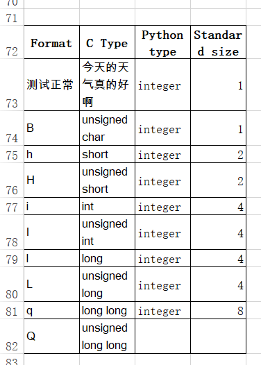
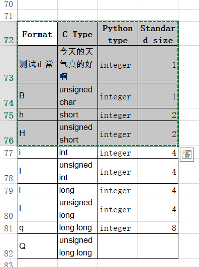
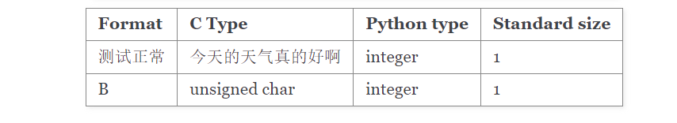

# sphinx-formatter
A command line to format string to Restructured Text FOR SPHINX.

## Install

```
python setup.py install
```

## Usage

The script contains a command line.

```
$ shpinx-formater table -h
usage: sphinx-formatter table [-h] [-o OUTPUT_TYPE] [--dry-run]
                              [--no-include-header]

options:
  -h, --help            show this help message and exit
  -o OUTPUT_TYPE, --output-type OUTPUT_TYPE
                        set output type, [0, 1] supported. Default is 1.
  --dry-run             run and show the result, but not copy the result to
                        clipboard
  --no-include-header   the input data not include table header, default is False
```

The script has been adapted for Unicode characters.

## Common Usage

Add data to a excel



Copy area you want to format



Open a console and run command

```
$ sphinx-formatter table
+----------+--------------------+-------------+---------------+
| Format   | C Type             | Python type | Standard size |
+==========+====================+=============+===============+
| 测试正常 | 今天的天气真的好啊 | integer     | 1             |
+----------+--------------------+-------------+---------------+
| B        | unsigned char      | integer     | 1             |
+----------+--------------------+-------------+---------------+


All the data has copied. You can use [ctrl+v] to paste data to the editor.
```

Paste text to the .rst file, run `make html`, and you can see the compiled result of this table by Sphinx.



